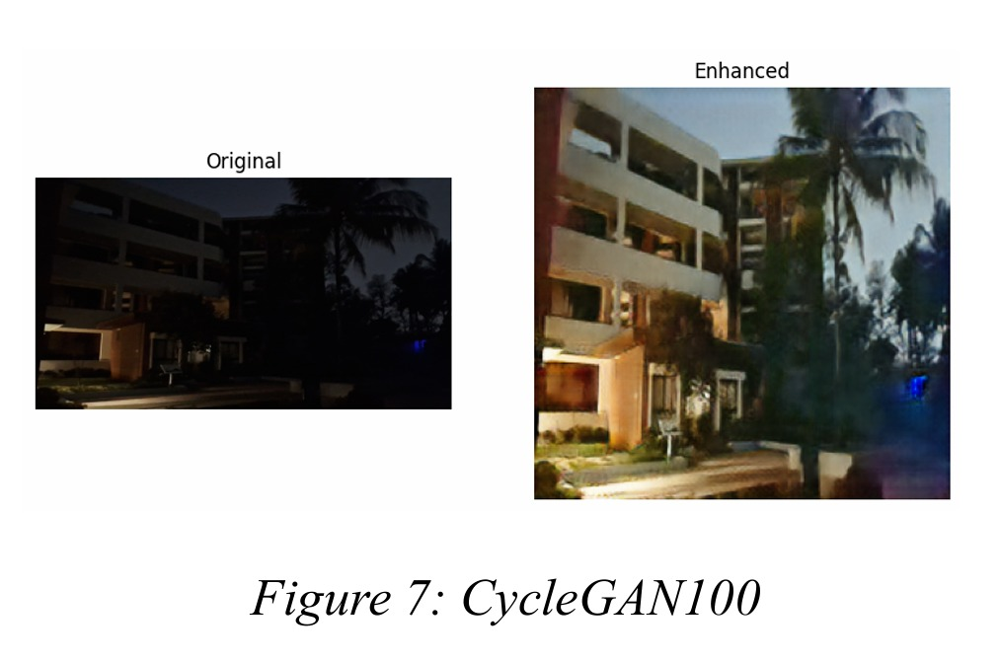
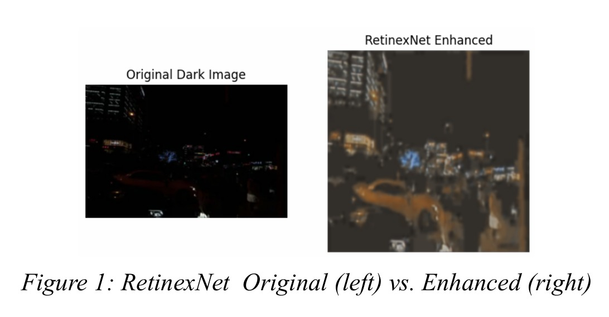
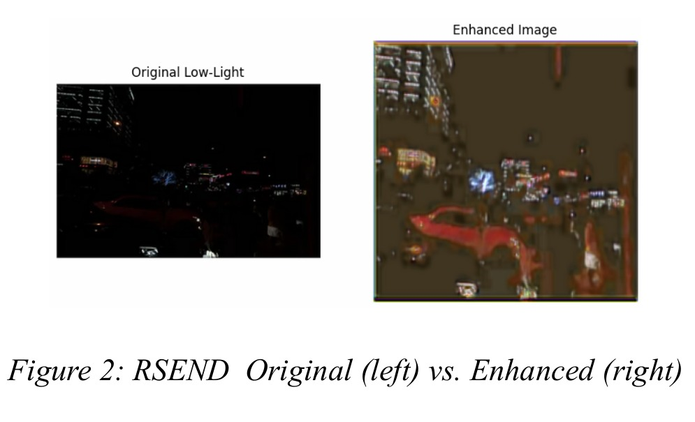
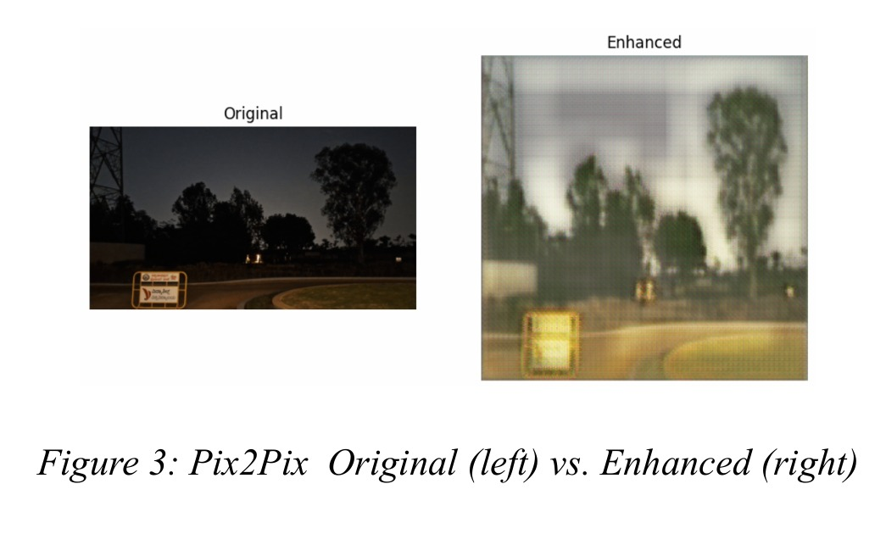

# Deep Learning Low-Light Image Enhancement

## Overview

Low-light image enhancement is an important computer vision task that aims to improve image visibility, preserve details, and enhance visual quality under poor lighting conditions. Applications include surveillance systems, autonomous vehicles, medical imaging, mobile photography, and security monitoring.

This project presents a comparative study of multiple deep learning-based low-light image enhancement techniques, including RetinexNet, RSEND, Pix2Pix, CycleGAN, and D2BGAN. The models were evaluated using objective image quality metrics such as PSNR (Peak Signal-to-Noise Ratio) and SSIM (Structural Similarity Index Measure).

The final implementation focuses on a CycleGAN-based architecture for low-light image enhancement.

Note: All project resources, including source code, model outputs, visualizations, experimental results, and supporting materials, are contained within the LowLightImageEnhancement directory. Please refer to this folder for the complete project implementation and documentation.
---

## Objectives

* Enhance images captured under poor lighting conditions.
* Compare multiple deep learning approaches for image enhancement.
* Evaluate model performance using quantitative metrics.
* Analyze visual quality improvements across different architectures.
* Identify the most effective model for low-light image enhancement.

---

## Models Evaluated

### RetinexNet

A Retinex theory-based deep learning framework designed to decompose images into illumination and reflectance components for enhancement.

### RSEND

A deep learning-based enhancement model that focuses on restoring image brightness and details in dark environments.

### Pix2Pix

A supervised image-to-image translation framework based on conditional Generative Adversarial Networks (cGANs).

### CycleGAN

An unsupervised image translation model that learns mappings between low-light and enhanced image domains using cycle consistency loss.

### D2BGAN

A GAN-based image enhancement approach designed to improve visual quality and brightness in low-light images.

---

## Dataset

This project uses a combined dataset created from two widely used low-light image enhancement benchmarks:

### 1. LOL (LOw-Light) Dataset
- Source: https://www.kaggle.com/datasets/soumikrakshit/lol-dataset
- Contains 500 paired low-light and normal-light images.
- Split into 485 training pairs and 15 testing pairs.
- Introduced with the RetinexNet framework for supervised low-light image enhancement research. :contentReference[oaicite:0]{index=0}

### 2. LOL-v2 Dataset
- Source: https://www.kaggle.com/datasets/tanhyml/lol-v2-dataset
- An extended benchmark containing more challenging real-world low-light scenes.
- Includes LOL-v2 Real and LOL-v2 Synthetic subsets for robust evaluation. :contentReference[oaicite:1]{index=1}

- The paired dataset (LOL + LOL-v2) consists of 2,290 pairs of images, including training (1603), 
validation (343), and test (344).  
-The unpaired dataset contains 6,000 dark and 2,290 bright unpaired images.  

### Combined Dataset

To improve model robustness and generalization, images from both LOL and LOL-v2 datasets were combined during experimentation and evaluation. The combined dataset provides:
- Diverse indoor and outdoor scenes
- Real-world low-light conditions
- Higher variation in illumination levels
- Improved benchmarking across multiple enhancement models

The dataset was used to compare the performance of RetinexNet, RSEND, Pix2Pix, CycleGAN, and D2BGAN using PSNR and SSIM evaluation metrics.

---

## Methodology

The project follows the following workflow:

1. Dataset preprocessing and image normalization
2. Training and evaluation of multiple enhancement models
3. Performance comparison using image quality metrics
4. Visual comparison of enhanced outputs
5. Selection of the best-performing architecture

---

## Evaluation Metrics

### PSNR (Peak Signal-to-Noise Ratio)

Measures the reconstruction quality of enhanced images compared to ground truth images.

Higher PSNR indicates better image quality.

### SSIM (Structural Similarity Index Measure)

Measures structural similarity between enhanced and reference images.

Higher SSIM indicates better preservation of image details and structures.

---

## Results

### Key Findings

* CycleGAN achieved the highest overall enhancement performance in terms of image quality.
* RetinexNet demonstrated strong structural preservation.
* Pix2Pix produced visually enhanced images but showed lower metric performance compared to CycleGAN.
* D2BGAN improved brightness but struggled to preserve fine details.
* The comparative analysis demonstrates the effectiveness of GAN-based approaches for low-light image enhancement tasks.

---

## Visualizations

### Model Comparison


### CycleGAN Output



### RetinexNet Output



### RSEND Output



### Pix2Pix Output



### Training Loss Curve


---

## Repository Structure

```text
Deep-Learning-Low-Light-Image-Enhancement/
│
├── Images/
│   ├── CycleGAN.jpeg
│   ├── Loss Curve.jpeg
│   ├── Model Comparison.jpeg
│   ├── Pix2Pix.jpeg
│   ├── RSEND.jpeg
│   └── Retinex.jpeg
│
├── Code.ipynb
├── Report.pdf
├── requirements.txt
└── README.md
```

---

## Technologies Used

* Python
* PyTorch
* NumPy
* Pandas
* OpenCV
* Matplotlib
* Scikit-image
* Scikit-learn
* Jupyter Notebook

---

## Installation

Clone the repository:

```bash
git clone https://github.com/your-username/Deep-Learning-Low-Light-Image-Enhancement.git
```

Install dependencies:

```bash
pip install -r requirements.txt
```

Launch Jupyter Notebook:

```bash
jupyter notebook
```

Open:

```text
Code.ipynb
```

---

## Future Improvements

* Train on larger low-light image datasets.
* Explore transformer-based enhancement architectures.
* Improve real-time inference performance.
* Deploy the enhancement pipeline as a web application.
* Extend evaluation using additional image quality metrics.

---

## Author

**Kshiti Anil Kumar**

GitHub: https://github.com/KshitiAnilKumar

---

## License

This project is intended for educational and research purposes.
